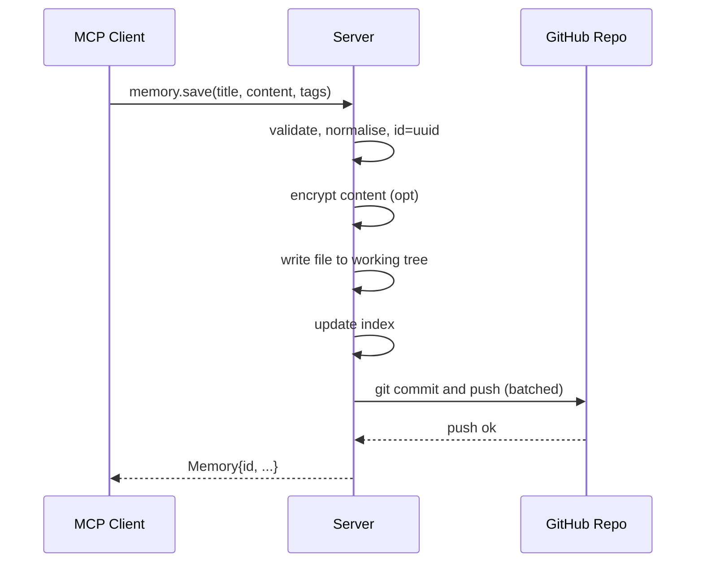
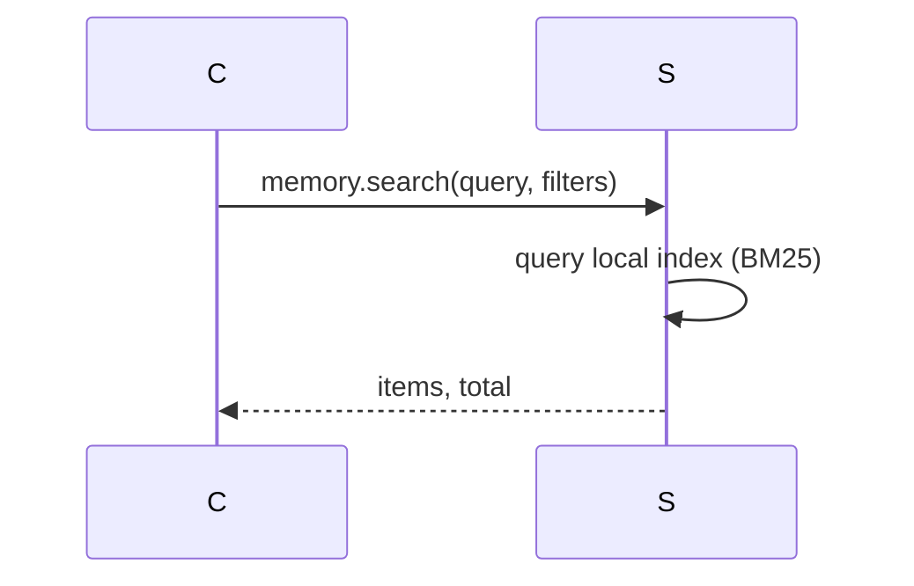

# MCP GitHub Memory Server — Technical Specification (Rust)

## TL;DR

A Rust MCP server that behaves like a "basic memory" server, with the same tool surface for drop‑in use, but pluggable storage backends. Primary storage is a GitHub repository using either a GitHub App or a PAT. It also supports a local filesystem backend for offline or air‑gapped use. The server manages sync, conflict resolution, optional end‑to‑end encryption, and an on‑disk full‑text index for fast recall. A migration path from an existing "basic memory" store is provided via a CLI importer and an API‑compatible mode.

---

## 1. Purpose and Goals

**Goal**: Provide an MCP server that implements memory operations compatible with the common "basic memory" servers, while storing memories in GitHub and supporting local mode without code changes on the client side.

**Key objectives**:

1. Behavioural parity with basic memory tool semantics so clients can switch without changes.
2. Storage in a GitHub repository with full history, audit, and collaboration via PRs if desired.
3. Local filesystem storage for offline or private environments.
4. Clear migration from file‑based or JSONL "basic memory" stores to GitHub.
5. Strong performance through Rust, async IO, and a local index for fast queries.
6. Security options: end‑to‑end encryption, least‑privilege GitHub credentials, and content minimisation.

**Non‑goals**:

* Serving as a general knowledge base or vector database for long documents.
* Providing a UI beyond basic health and metrics endpoints.
* Automatic summarisation or embedding by default. These are add‑ons.

---

## 2. User Stories

* As an MCP client, I can `save`, `search`, `get`, and `delete` memories with the same tools and parameters as basic memory.
* As an operator, I can configure the server to either write to a GitHub repo or a local directory.
* As an operator, I can enable encryption so only holders of the key can read memory contents.
* As a power user, I can import existing JSON or JSONL memories from a previous basic memory server.
* As a team, we can review changes via PRs and branch protection, or allow direct commits for simplicity.
* As a laptop user, I can work offline in local mode and later `sync push` to GitHub.

---

## 3. High‑Level Architecture

```
┌─────────────────────────────────────────────────────────────────┐
│                         MCP Client (IDE, Agent)                 │
│    JSON‑RPC over stdio or WebSocket, MCP tools and resources    │
└──────────────┬──────────────────────────────────────────────────┘
               │
        JSON‑RPC server (MCP)
               │
┌──────────────▼─────────────────────┐
│        Memory Service Layer        │  - validation, normalisation
│  (commands: create, update, get,   │  - ID generation, timestamps
│   search, delete, import, sync)    │  - conflict detection
└──────────────┬─────────────────────┘
               │
       Storage abstraction (trait)
     ┌─────────┴───────────┬────────────┐
     │                     │            │
┌────▼────┐          ┌─────▼─────┐ ┌────▼─────┐
│ GitHub  │          │ Local FS  │ │ Ephemeral│
│ adapter │          │ adapter   │ │ adapter  │
└────┬────┘          └─────┬─────┘ └────┬─────┘
     │                     │            │
     │        ┌────────────▼────────────┐
     │        │   Local Index Engine    │  milli-core or SQLite FTS5
     │        │  (full‑text, tags, TTL) │
     │        └────────────┬────────────┘
     │                     │
     │        ┌────────────▼────────────┐
     │        │   Crypto Envelope (opt) │  age/X25519
     │        └──────────────────────────┘
```

* **MCP transport**: stdio for local, WebSocket for remote.
* **Service layer**: implements business rules, validation, and maps to storage.
* **Storage adapters**: GitHub via local clone or Contents API. Local FS for offline or air‑gapped usage. Ephemeral for tests.
* **Index**: on‑disk search index for speed, rebuilt incrementally on writes and on sync pulls.
* **Crypto**: optional end‑to‑end encryption using age. Ciphertext is what lands in Git.

---

## 4. Data Model

All memories share a single canonical schema. File format on disk is JSON, one file per memory for easier merges.

```json
{
  "id": "mem_01HVF0W7P4K5A3S6D",               
  "version": 2,                                  
  "type": "fact",                              
  "title": "User prefers Celsius",             
  "content": "Always display temperatures in °C.",
  "tags": ["preference", "temperature"],      
  "source": {
    "agent": "mcp-client-name",
    "session": "2025-10-27T12:01:02Z",
    "origin": "chat",
    "app": "your-ide-or-app"
  },
  "score": 0.92,                                 
  "ttl": null,                                   
  "created_at": "2025-10-27T12:01:02Z",
  "updated_at": "2025-10-27T12:01:02Z",
  "deleted_at": null,                            
  "encryption": {
    "algo": "age-x25519",
    "kid": "age1ql...",
    "encrypted": false                           
  },
  "compat": {                                    
    "basic_id": "abc123",                      
    "aliases": ["note", "kv"]
  }
}
```

**Field notes**:

* `type` values: `fact`, `preference`, `profile`, `reminder`, `note`, `policy`.
* `score`: optional importance. Used for ranking in search.
* `ttl`: ISO 8601 duration or null. Server enforces expiry on queries.
* `deleted_at`: tombstone for soft deletes. Physical removal is configurable.
* `encryption.encrypted`: true means `content` and `title` are ciphertext. Non‑searchable unless using client‑side searchable encryption add‑on.

**On‑disk layout** (one memory per file):

```
repo_root/
  memories/
    2025/10/27/mem_01HVF0...json
    2025/10/27/mem_01HVF1...json
  indexes/ (optional, not committed if using local‑only index)
  meta/
    MANIFEST.json
    SCHEMA_VERSION
```

`MANIFEST.json` contains recently touched IDs, index checksum, and adapter metadata to speed warm‑up.

---

## 5. Storage Adapters

### 5.1 GitHub Adapter

Two operation modes:

1. **Local clone + git push**

   * Use `git2` or `gix` to manage a local bare or working clone under the server data dir.
   * Auth via GitHub App, PAT classic, or fine‑grained PAT.
   * Branch strategy per device: `devices/<device_id>` that merges to `main` via fast‑forward or auto‑merge.
   * Pros: efficient, history preserved, easier conflict resolution with three‑way merge.
   * Cons: needs git in process and network stability.

2. **GitHub Contents API**

   * Use `octocrab` to call `PUT /repos/{owner}/{repo}/contents/{path}`.
   * Pros: simpler deploys, no local repo.
   * Cons: higher API call volume, risk of rate limits, awkward merge conflict handling.

**Recommended default**: local clone + push. Contents API as fallback for restricted environments.

**Repository configuration**:

* Repo name: configurable, default `mcp-memory`.
* Path root: `memories/`.
* Optional PR workflow. When enabled, writes happen to `devices/<device_id>`, then a PR to `main` is opened with a template commit message, auto‑approved by a GitHub App if permitted.
* Commit messages follow Conventional Commits:

  * `feat(mem): add <title> [mem:<id>]`
  * `fix(mem): update <title> [mem:<id>]`
  * `chore(mem): delete <title> [mem:<id>]`

**Conflict resolution**:

* If a file path exists with different content, perform three‑way merge on JSON field level.
* On irreconcilable conflicts, create `conflicts/<id>/<timestamp>.json` and open a PR with both versions.

**Webhooks** (optional):

* When running as a remote service with HTTPS, accept `push` webhooks to trigger incremental pulls and index updates.
* When not available, fall back to periodic polling with ETag caching.

**Rate limiting**:

* Use conditional requests and batch commits. Support `commit_batch_ms` to group small writes.
* Expose metrics for remaining rate limits.

**Auto-push**:

* Optional automatic push to remote after every write operation (`save`, `update`, `delete`).
* Enabled via CLI flag `--auto-push` with `--remote-url` or configuration (`github.auto_push = true`, `github.remote_url`).
* Flush pending commits before pushing to ensure consistency.
* Push failures are logged but do not fail the write operation (commits remain local).
* Tracing spans track auto-push duration and outcome.

### 5.2 Local Filesystem Adapter

* Root path configurable. Same on‑disk layout as GitHub working tree to allow later `git init` and remote add.
* Atomic writes via temp file then rename. File locks via `fs2` or OS primitives.
* Ideal for offline and air‑gapped machines.

### 5.3 Ephemeral Adapter

* In‑memory map for integration tests and benchmarks.

### 5.4 Project Layout and Isolation

The Basic Memory MCP server treats each “project” as an isolated directory tree. To maintain compatibility we mirror that contract:

* Storage roots: every project lives under its own subdirectory (for example `memories/<project>/…`). Index shards, manifests, and sync state are scoped to the active project root.
* Selection precedence: the effective project is chosen in this order—(1) process-level override (`gitmem serve --project`, config `default_project_mode`), (2) per-call `project` parameter supplied by the client/tool shim, (3) discovery mode, where the agent lists known projects and caches the user’s choice for the session.
* Isolation guarantees: when a project is marked project-only (e.g., shared repositories), cross-project reads are disallowed unless the operator explicitly switches mode. `list_memory_projects` and `list_directory` should surface the available project folders so agents can present a picker.
* Resource addressing: resource URIs include project context (`mem://<project>/<memory_id>`) to prevent leakage across folders.

---

## 6. Indexing and Search

* **Engine**: milli-core (Meilisearch's embedded index) preferred for portable pure Rust performance across Intel, ARM, and sandboxed environments. SQLite FTS5 remains optional behind a feature flag for lightweight deployments.
* **Indexed fields**: `title`, `content`, `tags`, `type`, `created_at`, `updated_at`, `score`.
* **Query**: default is BM25 with filters on tags, type, time range, TTL enforcement, and optional sort by recency or score.
* **Async indexing**: Index updates are queued via an unbounded channel and processed by a background worker task. MCP tool responses return immediately without waiting for indexing to complete, enabling high throughput writes.
* **Queue monitoring**: Worker logs warnings when queue depth exceeds 5000 items. Graceful shutdown drains remaining queue items (up to 5 seconds).
* **Incremental updates**: index updated asynchronously on writes. On startup, index is rebuilt if checksum differs.
* **Encryption impact**: if encrypted, only metadata fields are indexed unless searchable encryption add‑on is enabled.

---

## 7. Security and Privacy

* **Auth to GitHub**: GitHub App with repository write permission recommended. Fine‑grained PAT supported. PAT classic only as last resort.
* **Encryption**: Optional age X25519 public keys. Server encrypts `title` and `content` before writing. Keys are stored locally only. Multiple recipients supported.
* **Secret handling**: read credentials from environment or OS keychain. Never commit secrets. Support `GITHUB_TOKEN_CMD` to exec an external credential helper.
* **PII minimisation**: allow pattern filters to redact PII before commit.
* **Access control**: single tenant by default. For multi‑user, enforce path partitioning under `tenants/<user_id>/...` and require per‑tenant key material.

---

## 8. MCP Surface — Tools and Resources

The server registers the following tools. Names match common basic memory servers for drop‑in compatibility. Aliases allow a richer surface without breaking clients.

### 8.1 Tools

To stay in lock-step with the OSS Basic Memory MCP server (v0.15.0), our compatibility layer must expose the full upstream surface in addition to the `memory.*` shortcuts documented below:

* Knowledge management: `write_note`, `read_note`, `edit_note`, `view_note`, `delete_note`, `move_note`, `read_content`.
* Search & discovery: `search_notes`, `recent_activity`, `build_context`, `list_directory`.
* Project management: `list_memory_projects`, `create_memory_project`, `delete_project`, `sync_status`. (`switch_project` and `get_current_project` are deprecated; enable only for backwards compatibility.)
* Utility & visualization: `canvas`.
* ChatGPT-integration shims: `search`, `fetch` (format results for assistant UX).
* Prompt catalog helpers: `ai_assistant_guide`, `continue_conversation`, and formatted variants of `search_notes`, `recent_activity`, `sync_status`.

Each tool must map to an internal handler that enforces project scoping rules (Section 5.4) and returns payloads consistent with upstream schemas.

1. `memory.save` (alias: `memory.create`)

   * **Params**:

     ```json
     {
       "title": "string",
       "content": "string",
       "type": "string",
       "tags": ["string"],
       "ttl": "string or null",
       "score": "number or null"
     }
     ```
   * **Returns**: the full Memory object.

2. `memory.get`

   * **Params**: `{ "id": "string" }`
   * **Returns**: Memory object or not found error.

3. `memory.search`

   * **Params**:

     ```json
     {
       "query": "string",
       "filters": {"type": ["string"], "tags": ["string"]},
       "time_range": {"from": "ISO", "to": "ISO"},
       "limit": 50,
       "offset": 0,
       "sort": "relevance|recency|score"
     }
     ```
   * **Returns**: `{ "items": [Memory], "total": 123 }`.

4. `memory.update`

   * **Params**:

     ```json
     {
       "id": "string",
       "patch": { "title": "string", "content": "string", "tags": ["string"], "type": "string", "ttl": "string or null", "score": 0.9 }
     }
     ```
   * **Returns**: updated Memory.

5. `memory.delete`

   * **Params**: `{ "id": "string", "hard": false }`
   * **Returns**: `{ "ok": true }`.

6. `memory.import.basic`

   * Import from a basic memory JSON or JSONL file or directory.
   * **Params**: `{ "path": "string", "dry_run": false, "map_types": {"note":"fact"} }`.

7. `memory.sync`

   * For GitHub mode, pull, merge, reindex, and push if needed.
   * **Params**: `{ "direction": "pull|push|both", "pr": false }`.

8. `memory.encrypt` and `memory.decrypt` (admin‑only)

   * Re‑encrypt or decrypt records in place when turning encryption on or off.

### 8.2 Resources

* `resource:list` exposes a browsable list of memory file URIs `mem://<id>` and `file://...` for local debug.
* `resource:read` returns the JSON content for a specific memory file.

### 8.3 Session and Capabilities

* On `initialize`, the server announces capability flags:

  ```json
  {
    "capabilities": {
      "memory": { "version": 1, "encryption": true, "search": "bm25", "ttl": true },
      "storage": { "github": true, "local": true }
    }
  }
  ```


### 8.4 External Folder Linking (Basic Memory parity)

Basic Memory lets users bind an existing folder (for example an Obsidian vault) to a project and keeps that folder in sync. GitMem must now provide the same surface, enriched with structured metadata and configurable watcher behaviour.

#### 8.4.1 MCP surface

* **Linking**: `project.link_folder` accepts `{ "project": "logbook", "path": "~/Vault", "include": ["**/*.md"], "exclude": ["**/tmp/**"], "watchMode": "poll", "pollIntervalMs": 30000, "jitterPct": 20 }`.
  * Returns a full metadata block so clients do not need to call `list_links` immediately afterwards:

    ```json
    {
      "project": "logbook",
      "path": "~/Vault",
      "displayPath": "~/Vault",
      "resolvedPath": "/Users/alex/Vault",
      "linkId": "lf_abcd1234",
      "include": ["**/*.md"],
      "exclude": ["**/tmp/**"],
      "watch": {
        "mode": "poll",
        "pollIntervalMs": 30000,
        "jitterPct": 20,
        "platform": null
      },
      "createdAt": "2025-11-04T12:34:11Z",
      "lastScan": null,
      "lastError": null,
      "fileCount": 0,
      "totalBytes": 0,
      "status": "idle"
    }
    ```

    The schema mirrors the Basic Memory OSS server so Codex and Cursor clients can reuse their compatibility layers.
  * If `watchMode` is omitted we default to the workspace setting (see configuration). Acceptable values in M5: `poll`. Future releases may add `native` (platform watchers).
* **Unlinking**: `project.unlink_folder { "project": "logbook", "path": "~/Vault" }` removes the binding. Supplying no `path` removes every link attached to the project.
* **Listing**: `project.list_links { "project": "logbook" }` returns all bindings for that project. Each entry contains the metadata above plus:
  * `resolvedPath` (canonical path on disk),
  * `include`/`exclude` glob patterns,
  * `status` (`idle`, `polling`, `error`),
  * `lastScan` timestamp, `lastError` (string or null),
  * `fileCount`, `totalBytes`, and `lastRuntimeMs` from the most recent scan.
  Invoking without a project lists all bindings across the workspace.
* **Syncing**: `memory.sync { "direction": "external", "project": "logbook", "paths": ["~/Vault"] }` runs an on-demand scan. The response contains `reports`, each item reporting `project`, `linkId`, `path`, `displayPath`, `include`, `exclude`, `scanned`, `created`, `updated`, `deleted`, `totalBytes`, `runtimeMs`, and `lastError`.

#### 8.4.2 Storage contract

* **Link registry**: local storage persists link metadata in `meta/<project>/links.json`. Each entry includes:
  * `id` (stable identifier), `display_path`, `resolved_path`, `include`, `exclude`.
  * `watch`: `{ "mode": "poll", "poll_interval_ms": 30000, "jitter_pct": 20, "platform": null }`.
  * `created_at`, `last_scan`, `last_error` (nullable string), `file_count`, `total_bytes`, and a `mappings` object tracking relative file paths → memory IDs.
* **Memory metadata**: files imported from linked folders update the `Memory.source` block with:
  * `origin = "linked_folder"`,
  * `file_uri` (`file:///` absolute path),
  * `relative_path` (path relative to the linked root),
  * `checksum_sha256`,
  * `linked_folder_id`,
  * `file_mtime` and `file_size`.
  These fields are returned to clients via `memory.get`, `memory.search`, and resource reads. Tags continue to include `project:<id>` plus `linked`.
* **Front-matter**: Markdown front-matter keys `title`, `tags`, `type`, and `created` populate the corresponding `Memory` fields. Remaining keys are stored under `Memory.source.front_matter` as a JSON object for client-side use.
* **Safety**: linking outside the user’s home directory is rejected unless `storage.local.allow_outside_home = true`. Recursive linking (linking a directory underneath an existing memory root) is forbidden. Symlinks are resolved to their canonical targets before linking.

#### 8.4.3 Watchers and polling

* **Multi-target scheduling**: the server maintains a dedicated poller per linked folder. Poll intervals default to 30 s, but each link can override the interval and jitter via `watchMode` parameters or workspace defaults. This mirrors the behaviour documented for the Basic Memory CLI (`basic-memory sync --watch`) so compatibility shims can reuse existing scheduling assumptions.
* **Jitter control**: we add configuration keys so operators can spread poll load:

  ```toml
  [storage.local.watch]
  mode = "poll"              # poll | native (future)
  poll_interval_ms = 30000    # default interval
  jitter_pct = 20             # +/- percent jitter applied per cycle
  max_concurrent = 4          # cap the number of simultaneous scans
  ```

  `project.link_folder` falls back to these values when per-link overrides are not provided. Jitter is applied deterministically per link (based on its id) so schedules remain stable across restarts.
* **Native watchers (roadmap)**: configure `mode = "native"` to request platform-specific watchers. In M5 we only honour `poll`—the native mode will be introduced in M6 starting with macOS (FSEvents).
* **Error handling**: repeated scan failures push the `linkStatus` into `error` state, surface the last error message, and require either a rescan or unlink to clear. MCP responses include this status so clients can alert the user.
* **Hidden/temp files**: we ignore dotfiles, `*.tmp`, and editor swap files by default. Operators can opt in via include patterns.

#### 8.4.4 CLI parity

* `gitmem link-folder --root ./data --project notes --path ~/Vault --include "**/*.md" --exclude "**/build/**" --watch-mode poll --poll-interval 45000 --jitter 10`
* `gitmem unlink-folder --root ./data --project notes --path ~/Vault`
* `gitmem list-links --root ./data [--project notes]`
* `gitmem rescan-links --root ./data --project notes --path ~/Vault`

Each command prints per-link summaries including file counts, deltas, and watch status. CLI defaults mirror `storage.local.watch`.

#### 8.4.5 Capabilities

`initialize` advertises the capability surface under `experimental.gitmem.storage.local`:

```json
"storage": {
  "github": { "enabled": true },
  "local": {
    "enabled": true,
    "linked_folders": true,
    "supports": {
      "link_folder": true,
      "unlink_folder": true,
      "list_links": true,
      "sync_external": true,
      "watch_modes": ["poll"],
      "metadata": ["checksum_sha256","file_uri","relative_path","front_matter"]
    }
  }
}
```

`project.list_links` and `memory.sync` responses honour this schema, enabling clients to adapt to future watch modes.

---

## 9. Migration from Basic Memory

### 9.1 CLI Importer

`mcp-gitmem import --from /path/to/basic.jsonl --repo gh:owner/mcp-memory --encrypt --map-type note=fact`

* Detects JSON vs JSONL schema variants from common basic memory servers.
* Generates stable IDs using hashing of normalised content and created_at to avoid duplication.
* Writes to local index and storage adapter. In GitHub mode, commits in batches.
* Produces a report with imported, skipped, and deduped counts.

### 9.2 API‑compatible Mode

* Enable `compat.basic_memory=true` to register tool names and parameter shapes exactly matching the basic server. This allows clients to switch endpoints without code changes.

### 9.3 ID Mapping

* Store `compat.basic_id` in each Memory for traceability.
* Provide `memory.lookupBasicId` as an extra tool for audits.

---

## 10. Configuration

Format: TOML or YAML. Example TOML:

```toml
[server]
transport = "stdio"              # stdio or ws
bind_addr = "0.0.0.0:8177"       # used only for ws
state_dir = "~/.mcp/gitmem"

[storage]
backend = "github"               # github | local | ephemeral

[storage.github]
repo = "owner/mcp-memory"
default_branch = "main"
device_branch = "devices/${HOSTNAME}"
clone_mode = "bare"               # bare | working
push_batch_ms = 500
pr_workflow = false
auto_push = false                 # enable automatic push after writes
remote_url = ""                   # e.g., "https://github.com/user/repo.git" or "file:///path"
# Auth precedence: env GITHUB_TOKEN, keychain, exec helper

[storage.local]
root = "~/mcp-memory"

[crypto]
enabled = true
age_recipients = ["age1qlyourpubkey..."]

[index]
engine = "tantivy"               # tantivy | sqlite
path = "~/.mcp/gitmem/index"

[compat]
basic_memory = true

[limits]
max_memory_size = 81920          # bytes per record after encryption
max_total_daily = 10000          # rate control
```

Environment variables override config keys. Support `.env` files.

---

## 11. Sync and Conflict Handling

* **Write path**: create temp file, write JSON, fsync, rename. Update index. Commit to local repo. Push according to `push_batch_ms`.
* **Pull path**: fetch remote, merge fast‑forward or rebase device branch. Rebuild index incrementally by scanning changed files.
* **Conflicts**: three‑way JSON merge on fields `title`, `content`, `tags`, `type`, `ttl`, `score`. If both sides changed the same field, create conflict artifact and mark memory with `tags += ["conflict"]`. Optionally open a PR.
* **Offline**: queue commits locally with monotonic sequence numbers. On reconnection, push in order.

---

## 12. Performance Targets

* Save operation: p50 < 5 ms local, < 50 ms with GitHub batch push disabled, excluding network latency.
* Search on 50k memories: p95 < 50 ms with warm cache.
* Import 100k records: sustained > 1k writes per second to local index, Git push in batches of 500 files.

Benchmarks shipped via `cargo bench` and a dataset generator.

---

## 13. Deployment

### 13.1 Local binary

* Install via `cargo install mcp-gitmem`.
* Run in stdio mode for IDEs. Example: `mcp-gitmem --config ~/.config/mcp/gitmem.toml`.

### 13.2 Docker

`docker run -v $HOME/.mcp/gitmem:/data -e GITHUB_TOKEN=... ghcr.io/yourorg/mcp-gitmem:latest`.

### 13.3 Systemd unit

```
[Unit]
Description=MCP GitHub Memory Server
After=network-online.target

[Service]
ExecStart=/usr/local/bin/mcp-gitmem --config /etc/mcp/gitmem.toml
Environment=GITHUB_TOKEN=/run/secrets/github_token
User=mcp
Group=mcp
Restart=always

[Install]
WantedBy=multi-user.target
```

### 13.4 Remote over WebSocket

* Start with `--transport ws --bind 0.0.0.0:8177`. Place behind TLS terminator such as Caddy or Nginx.

---

## 14. Observability

* Structured logs via `tracing` with JSON output option.
* Metrics via OpenTelemetry exporter. Counters for writes, reads, conflicts, rate limit rejections.
* Health endpoint in ws mode: `GET /healthz` returns `{ ok: true, storage: "github" }`.

---

## 15. Errors and Status Codes

* MCP tool errors use `code` and `message`:

  * `E_NOT_FOUND`, `E_VALIDATION`, `E_RATE_LIMIT`, `E_CONFLICT`, `E_ENCRYPTION`, `E_STORAGE_IO`.
* Include correlation ID and last commit SHA for GitHub mode.

---

## 16. Testing Strategy

* Unit tests for service layer and JSON merge logic.
* Adapter contract tests run against both local and a mock GitHub server, plus live repo in CI on a private org.
* Property tests with proptest for merge behaviour and TTL expiry.
* Conformance tests for tool parameter schemas against basic memory fixtures.

---

## 17. Security Review Checklist

* Secrets only in environment or keychain.
* GitHub App tokens are short‑lived. Refresh automatically.
* Encryption tested for data at rest. No plaintext spill to logs. Redaction on error paths.
* PR workflow does not leak content in titles when encrypted. Use generic messages.

---

## 18. Roadmap

* **v1**: Parity with basic memory, GitHub and local backends, optional encryption, sync, index.
* **v1.1**: Webhook support, PR workflow, conflict PRs.
* **v1.2**: Optional embeddings with local models, hybrid search, re‑ranking.
* **v2**: Multi‑tenant with per‑tenant keys and policy tooling.

---

## 19. Example MCP Registration

```json
{
  "tools": [
    {
      "name": "memory.save",
      "description": "Create a new memory record.",
      "inputSchema": {"type":"object","properties":{
        "title":{"type":"string"},
        "content":{"type":"string"},
        "type":{"type":"string"},
        "tags":{"type":"array","items":{"type":"string"}},
        "ttl":{"type":["string","null"]},
        "score":{"type":["number","null"]}
      },"required":["content"]}
    },
    {"name":"memory.get","description":"Get a memory by id.","inputSchema":{"type":"object","properties":{"id":{"type":"string"}},"required":["id"]}},
    {"name":"memory.search","description":"Search memories.","inputSchema":{"type":"object","properties":{"query":{"type":"string"},"filters":{"type":"object"},"time_range":{"type":"object"},"limit":{"type":"integer"},"offset":{"type":"integer"},"sort":{"type":"string"}}}},
    {"name":"memory.update","description":"Patch a memory.","inputSchema":{"type":"object","properties":{"id":{"type":"string"},"patch":{"type":"object"}},"required":["id","patch"]}},
    {"name":"memory.delete","description":"Delete a memory.","inputSchema":{"type":"object","properties":{"id":{"type":"string"},"hard":{"type":"boolean"}}}},
    {"name":"memory.import.basic","description":"Import from basic memory JSON/JSONL.","inputSchema":{"type":"object","properties":{"path":{"type":"string"},"dry_run":{"type":"boolean"}}}},
    {"name":"memory.sync","description":"Sync with storage backend.","inputSchema":{"type":"object","properties":{"direction":{"type":"string"},"pr":{"type":"boolean"}}}}
  ]
}
```

---

## 20. Example CLI

```
# Local mode, no GitHub
gitmem serve --backend local --root ~/mcp-memory

# GitHub mode using a GitHub App
gitmem serve --backend github --repo owner/mcp-memory --app-id 12345 --private-key /path/key.pem

# Import from a basic JSONL store
gitmem import --from ./basic.jsonl --encrypt --recipient age1qlyourpubkey...

# Sync and open a PR
gitmem sync --direction both --pr
```

---

## 21. Open Questions

* Do we require PR workflow by default for teams, or make it opt‑in only with branch protection guidance.
* Do we expose a resource tree that mirrors the repo for debug use, or keep it minimal.
* Should we store index artifacts in Git for reproducibility, or keep them local only.

---

## 22. Implementation Notes

**Rust crates**:

* Core: `serde`, `serde_json`, `chrono`, `uuid`, `thiserror`, `anyhow`.
* Async and server: `tokio`, `tokio-stream`, `axum` for ws mode, `tower`.
* MCP: generate or adopt an MCP JSON‑RPC layer (`jsonrpsee` or `tower-lsp` style with custom MCP glue).
* GitHub: `octocrab` for API, `git2` or `gix` for local repo.
* Index: `tantivy` or `rusqlite` with FTS5.
* Crypto: `age`, `age-core`.
* CLI: `clap`, `figment` or `config` for layered config.
* Observability: `tracing`, `tracing-subscriber`, `opentelemetry`.

**Code layout**:

```
crates/
  core/            # domain types, schema, merge, validation
  storage/         # traits and adapters (github, local, ephemeral)
  index/           # search index abstraction and impls
  server/          # MCP JSON‑RPC plumbing, tool handlers
  cli/             # gitmem binary
```

**Merge algorithm**:

* Parse both JSONs to structured types.
* Field‑by‑field merge using vector clocks: each record holds `last_edit` per field. The higher clock wins.
* If clocks equal and values differ, mark conflict.

**Schema versioning**:

* `SCHEMA_VERSION` file tracks current major version. Migrations run on startup when version changes.

---

## 23. Sample Memory Files

`memories/2025/10/27/mem_01HVF0.json`

```json
{
  "id": "mem_01HVF0",
  "version": 2,
  "type": "preference",
  "title": "Show temperatures in Celsius",
  "content": "Use °C when displaying temperatures.",
  "tags": ["preference", "ui"],
  "score": 0.8,
  "ttl": null,
  "created_at": "2025-10-27T12:01:02Z",
  "updated_at": "2025-10-27T12:01:02Z",
  "deleted_at": null,
  "encryption": {"algo": "age-x25519", "kid": "age1qly...", "encrypted": false},
  "compat": {"basic_id": "abc123", "aliases": ["note"]}
}
```

Encrypted variant stores ciphertext in `title` and `content`, and sets `encrypted=true`.

---

## 24. Example Sequence Diagrams

**Save in GitHub mode**



**Search**



---

## 25. Acceptance Criteria

* Tool names and input schemas are compatible with the basic memory client examples.
* Switching from a basic memory server requires only a config change on the client.
* GitHub and local backends pass the same contract tests.
* Encryption round‑trip is lossless and deterministic for identical inputs.
* Index returns relevant items for simple queries and respects filters and TTL.

---

## 26. Glossary

* **MCP**: Model Context Protocol.
* **Basic memory**: a minimal MCP memory server pattern that stores key facts as JSON.
* **Age**: simple modern encryption tool and format.
* **milli-core**: Rust full‑text engine extracted from Meilisearch; runs on LMDB and avoids SSSE3 runtime requirements on Apple Silicon.
